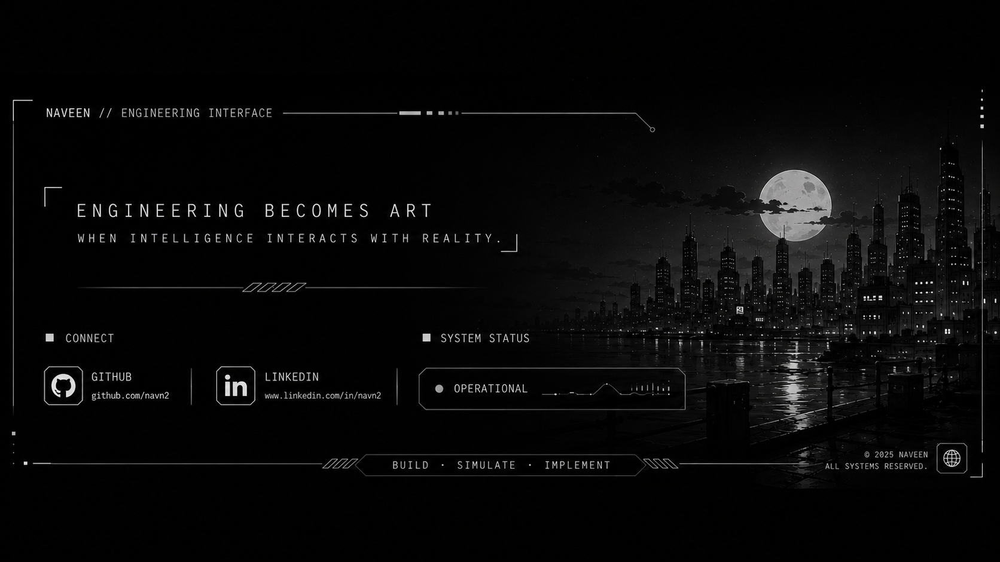

 

<h2>Namaste 🙏 I'm Naveen</h2>

  
  

---

<table>
  <tr>
    <td width="60%">
      <h3>💫 About Me</h3>
      <ul>
        <li>🎓 I am currently a 3rd-year engineering student, heavily focused on hardware-software integration.</li>
        <li>⚙️ I specialize in Real-Time Operating Systems (RTOS), with active projects focused on the microkernel architecture of QNX Neutrino and adaptive mixed-criticality task managers.</li>
        <li>💻 Currently building a local-first, feature-rich note-taking application exclusively for Windows using Flutter.</li>
        <li>📡 My research involves implementing Computer Vision and CNNs for RF signal classification and surveillance.</li>
        <li>🤝 I actively lead technical teams and manage sponsorship planning for national-level techno-management festivals.</li>
      </ul>
    </td>
    <td width="40%" align="center">
      
      </td>
  </tr>
</table>

 

<h3>📫 Connect with me:</h3>

  
  
  

 

  
  

 

  <h3>📚 Languages & Tools I Have Placed My Hands On</h3>
  

 

  <h3>💻 Tech Stack:</h3>
  
  
  
  
  
  

 

  

