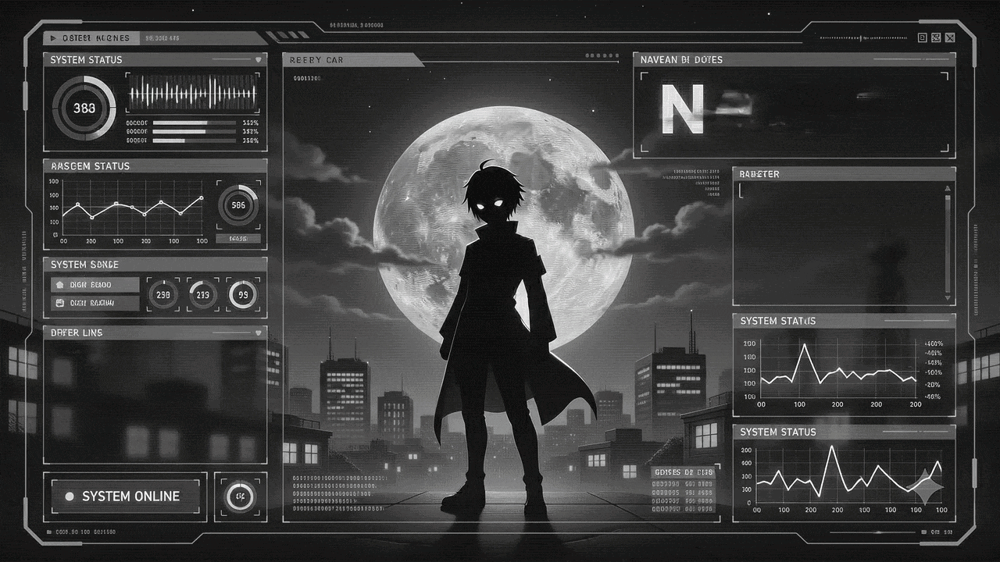
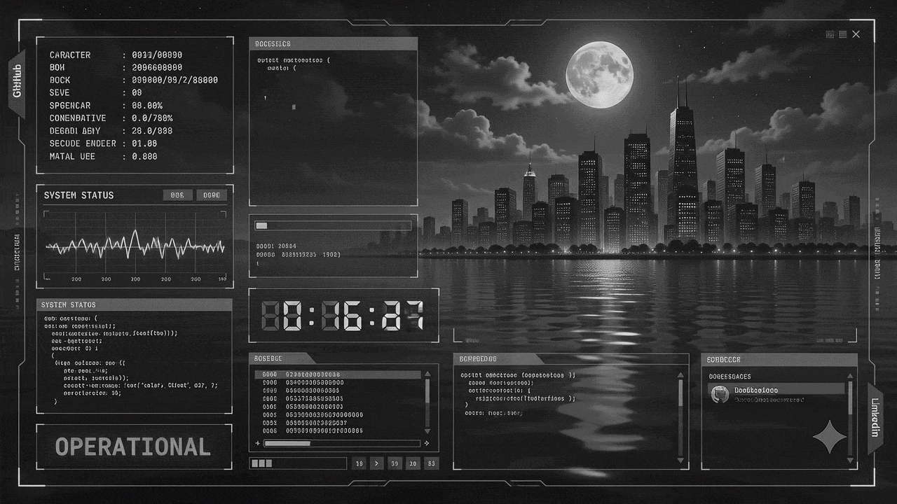

<div align="center">



<br>

<h2>I'm Naveen</h2>

<p align="center">
  
  
</p>

</div>

---

<table>
  <tr>
    <td width="60%">
      <h3>✦ CURRENT DIRECTIVES</h3>
      <p><i>Building systems where software gracefully interacts with reality.</i></p>
      <ul>
        <li><b>Architecting:</b> Adaptive mixed-criticality task managers using QNX Neutrino RTOS.</li>
        <li><b>Researching:</b> Computer Vision and CNN pipelines for RF signal classification.</li>
        <li><b>Shipping:</b> A local-first, data-driven Windows native application via Flutter.</li>
        <li><b>Leading:</b> Technical operations and sponsorship logistics for national techno-management festivals.</li>
      </ul>
  </tr>
</table>

 </td>
    <td width="40%" align="center">
      
    </td>

<br>
<!-- TERMINAL DIVIDER -->


<div align="center">


</div>

<br>

<!-- SYSTEM BOOT -->

<div align="center">

```txt
> INITIALIZING_ENGINEERING_INTERFACE...
> STATUS : ONLINE
> USER   : NAVEEN
````

</div>

---

# `> CONNECTION_PROTOCOL`

<div align="center">

<a href="mailto:YOUR_EMAIL_HERE">

</a>

<a href="https://linkedin.com/in/navn2">

</a>

<a href="https://github.com/navn2">

</a>

</div>

<br>

<!-- LIVE STATUS -->

<div align="center">


</div>

<br>

<!-- CYBER GRID -->

<div align="center">


</div>

---

# `> TOOLCHAIN_MATRIX`

<div align="center">


</div>

<br>

<div align="center">

```txt
[ SYSTEM MODULES LOADED ]
```

</div>

<br>

<div align="center">


</div>

<br>

---

# `> CURRENT_FOCUS`

<div align="center">

```txt
INTELLIGENT_SYSTEMS • EMBEDDED_AI • ROBOTICS • REAL_TIME_COMPUTING
```

</div>

<br>

<!-- FOOTER -->

<div align="center">


</div>

<br>

<div align="center">

```txt
> BUILD • SIMULATE • IMPLEMENT
> ENGINEERING BECOMES ART WHEN INTELLIGENCE INTERACTS WITH REALITY
```

</div>


</div>


<div align="center">
  
</div>
