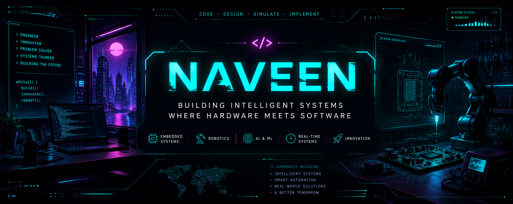

<div align="center">



</div>


<div align="center">


</div>

---

<div align="center">

```txt
> designing systems
> training models
> simulating machines
> turning ideas into reality
````

</div>

═══════════════════════════════════════════

# ⚡ About Me

```yaml
name: Naveen
role: Electronics & Communication Engineer

interests:
  - Embedded Systems
  - Robotics
  - AI + Machine Learning
  - Real-Time Systems
  - Automation
  - Simulation-Driven Engineering

philosophy:
  "Technology feels powerful when software begins
   interacting with the physical world."
```

```

